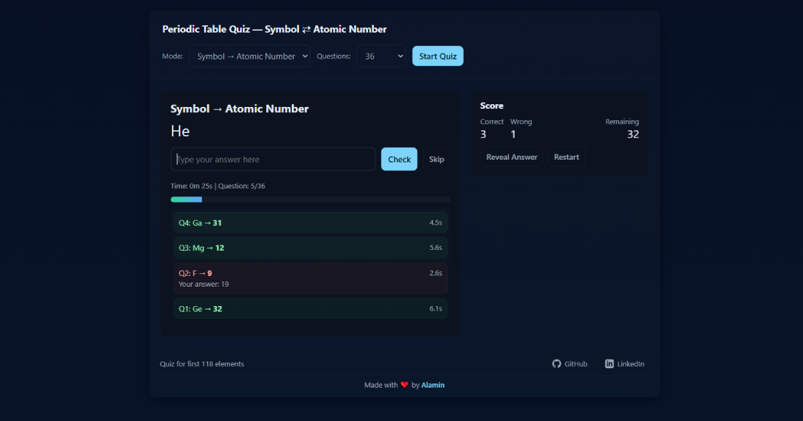

# Periodic Table Quiz

<div align="center">



**Test your chemistry knowledge with this interactive periodic table quiz!**

Match element symbols with atomic numbers across all 118 elements. Choose your mode, track your time, and improve your periodic table mastery.

[](https://ptquiz-alamin.vercel.app/)

</div>

---

## Features

- **Multiple Quiz Modes**

  - Symbol → Atomic Number
  - Atomic Number → Symbol
  - Mixed mode for extra challenge

- **Flexible Question Counts**

  - Practice with 10, 18, 36, 54, 86 questions, or all 118 elements
  - Questions drawn from the first N elements only

- **Smart Tracking**

  - Real-time timer and progress bar
  - Live score tracking (correct/wrong/remaining)
  - Detailed finish screen with performance insights

- **Performance Review**

  - Questions sorted by longest time taken
  - Visual indicators (❌) for elements you got wrong
  - Aggregated by element across all attempts

- **Responsive Design**

  - Fully mobile-friendly with rem-based units
  - Optimized for all screen sizes
  - Dark theme with smooth animations

- **Modular Configuration**
  - Easy to add/remove elements via `data.js`
  - Customizable question count options
  - Clean, maintainable codebase

---

## Technologies

- **HTML5** - Semantic markup
- **CSS3** - Modern responsive design with rem units
- **Vanilla JavaScript** - No frameworks, pure JS

---

## Project Structure

```
Periodic-table-quiz/
├── index.html          # Main HTML structure
├── style.css           # Fully responsive styles (rem units)
├── script.js           # Quiz logic and functionality
├── data.js             # Elements and config (edit here!)
├── public              # public assets
└── README.md           # You are here
```

---

## Configuration

Want to customize the quiz? Edit `data.js`:

### Add/Remove Elements

```javascript
elements: [
  { num: 1, symbol: "H" },
  { num: 2, symbol: "He" },
  // Add more elements here...
];
```

### Change Question Count Options

```javascript
countOptions: [10, 18, 36, 54, 86, "all"];
// Edit these numbers to change the dropdown options
```

The app will automatically update the UI based on your configuration!

---

## How to Play

1. **Select Mode**: Choose how you want to be quizzed

   - Symbol → Number: Given "H", answer "1"
   - Number → Symbol: Given "1", answer "H"
   - Mixed: Random combination of both

2. **Pick Question Count**: Select how many elements to practice

3. **Answer Questions**: Type your answer and press Enter or click Check

4. **Review Results**: See your time breakdown and mistakes at the end

5. **Practice & Improve**: Focus on elements that took you longest!

---

## Contributing

Contributions are welcome! Here are some ideas:

- Add element names alongside symbols
- Include element categories (metal, non-metal, etc.)
- Add difficulty levels
- Implement leaderboard/statistics
- Support for other languages

Feel free to open an issue or submit a pull request!

---

## License

This project is open source and available under the [Apache License V2.0](LICENSE).

---

## Author

**Alamin**

- LinkedIn: [@CodeWithAlamin](https://www.linkedin.com/in/CodeWithAlamin/)
- GitHub: [@CodeWithAlamin](https://github.com/CodeWithAlamin)
- Portfolio: [codewithalamin.com](https://codewithalamin.com)

---

## Acknowledgments

- Inspired by the need to memorize the periodic table
- Built with passion for chemistry and coding
- Thanks to everyone who tests and provides feedback!

---

<div align="center">

**Made with ❤️ by [Alamin](https://www.linkedin.com/in/CodeWithAlamin/)**

If you found this project helpful, give it a ⭐️!

</div>
